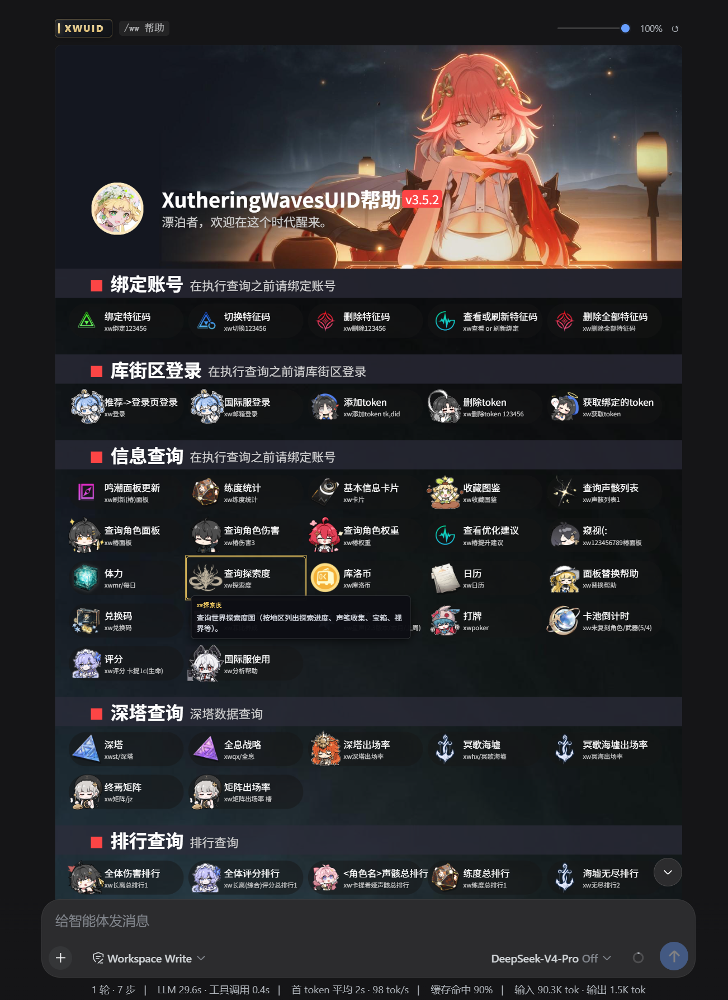
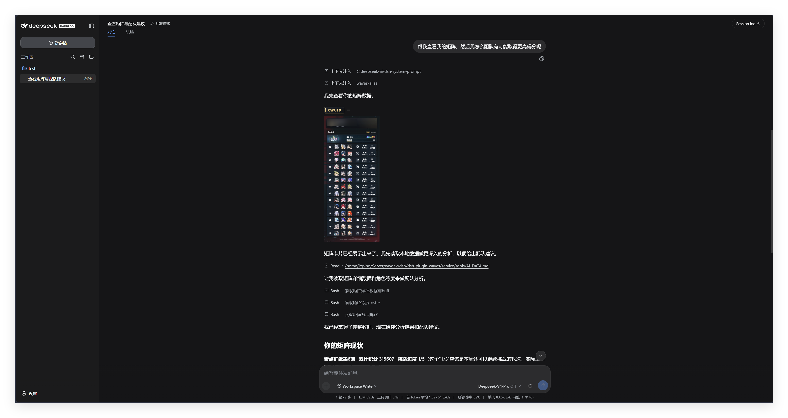
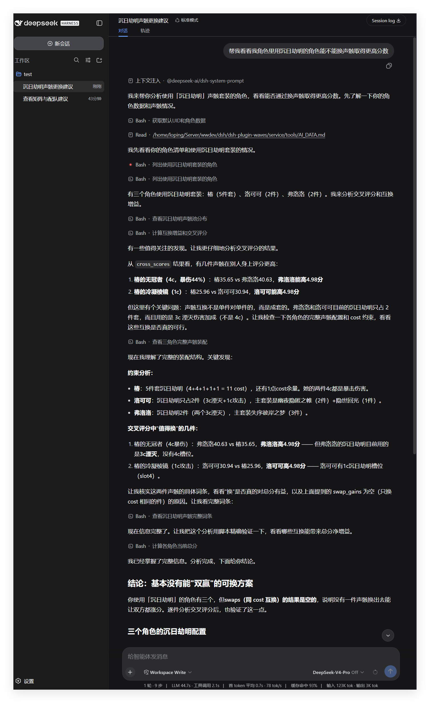
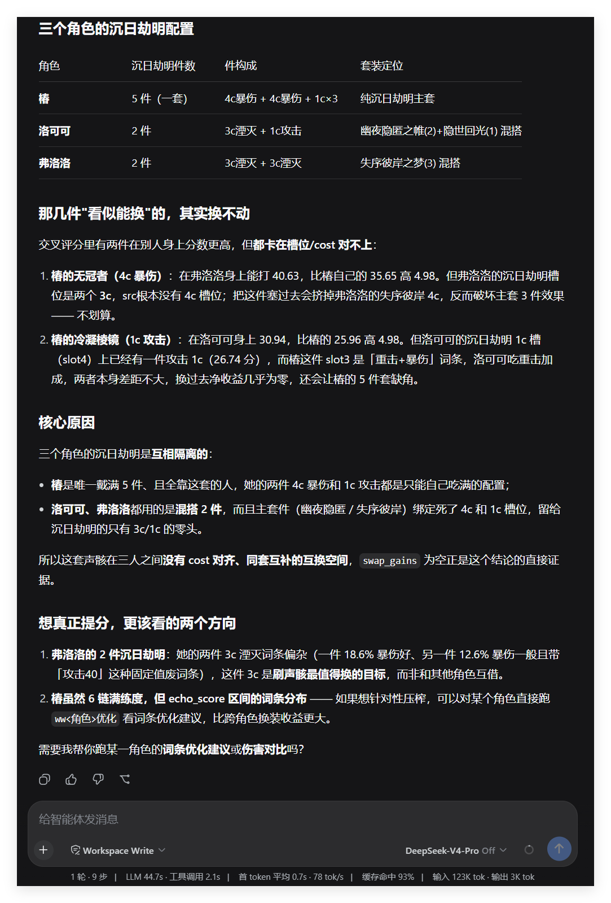

<p align="center">
  <a href="https://github.com/Loping151/XutheringWavesUID"></a>
</p>
<h1 align="center">dsh-plugin-waves</h1>
<p align="center">XutheringWavesUID 的 DeepSeek Harness 版本 · v0.0.1</p>

这是 [XutheringWavesUID](https://github.com/Loping151/XutheringWavesUID) 的 dsh 版：同一套鸣潮查询、
面板、伤害计算与评分、排行，由 [DeepSeek Harness](https://github.com/deepseek-ai/deepseek-harness)
提供原生渲染能力。

已内置 [RoverSign](https://github.com/Loping151/RoverSign)（签到）与 [ScoreEcho](https://github.com/Loping151/ScoreEcho)（声骸识图评分）。

图文结果直接以 HTML 卡片呈现；卡片里的角色可以点击，其余命令、算法、素材、模板全部与 [XutheringWavesUID](https://github.com/Loping151/XutheringWavesUID) 一致。

为模型提供了原生数据接口，模型完全可读用户数据。可自行搭配其他工具使用，比如让AI将数据自行填入其他排轴/伤害计算等网页工具（需对应工具支持）。

开新会话首次发送指令将同时发送你好，此为dsh目前固有限制，否则无法显示指令结果。

## 用例

<table>
<tr>
<td nowrap valign="top">




</td>
</tr>
</table>

## TODO

- [ ] 修修补补，完成迁移
- [ ] 补充游戏常识库：挑战规则、矩阵挑战的模板声骸配置、模态规则等（缺少尝试胡言乱语为已知问题，可以通过鼓励搜索解决，但不如固化常识知识）
- [ ] 补充库街区wiki文字攻略接口，注入常规配队知识
- [ ] 尝试寻找文字轴数据源
- [ ] 提供更多接口工具，便于在此之上自行搭建其他项目

本仓库仅迁移 XutheringWavesUID 内置方法和接口，以及处理通用知识，使用本插件数据接口继续开发应新建插件以实现功能解耦。

## 安装

Linux / macOS：

```sh
mkdir -p ~/dsh-plugins && cd ~/dsh-plugins         # 放哪都行, 换成你自己的目录
git clone https://github.com/Loping151/dsh-plugin-waves.git && cd dsh-plugin-waves
dsh plugin --profile web add file:.
dsh web
```

Windows（PowerShell）：

```powershell
mkdir -Force ~\dsh-plugins; cd ~\dsh-plugins
git clone https://github.com/Loping151/dsh-plugin-waves.git; cd dsh-plugin-waves
dsh plugin --profile web add file:.
dsh web
```

第一次启动时插件会自己把环境装好（一般来说）：建虚拟环境、装依赖、拉取三个上游插件、生成数据目录，
几分钟后服务就绪，不需要手动跑任何脚本。之后在对话里绑定账号即可用：
`ww登录` 保存登录态，与库街区登录冲突，同时登录办法需自行查找，`ww绑定<特征码>` 需要自行提供有效库街区token才可使用，原理为：街区点击他人主页查看信息，故至少需要一个登录态。

安装若卡住或失败，直接问 dsh 里的模型——插件会把完整排障步骤转交给它。

缺什么会尽量自己装：`uv`、Python 3.10–3.13（`uv` 拉官方构建，计算内核按版本分发）、
以及 `git`（Linux 走发行版包管理器，Windows 走 winget/choco/scoop）。装不上会说明要手工补什么，也可以直接问 dsh 里的模型。

<details>
<summary>手动安装 / 从机器人部署迁入数据</summary>

```sh
./install.sh          # 等价于自动安装

# 从聊天机器人版迁过来: 指向那边 gsuid_core 的 data 目录,
# 会迁入绑定关系、登录态、WavesToken、面板与抽卡记录、自定义素材,
# 并把归属改写到本地使用者名下(源库只读取快照, 不会改动)
./install.sh --src ~/gsuid_core/data
```

Windows 用 `install.ps1`，参数一一对应（若提示无法运行脚本，先 `Set-ExecutionPolicy -Scope Process Bypass`）：

```powershell
powershell -ExecutionPolicy Bypass -File .\install.ps1
powershell -ExecutionPolicy Bypass -File .\install.ps1 -Src C:\gsuid_core\data
```

</details>

## 用法

两种用法：

- **`/ww 深塔`、`/ww 椿面板`**——斜杠命令，host 直接执行，**不经过模型**，最快。
- **直接说话**——「看下我的深塔」「椿的面板怎么样」，模型理解后调用工具。
  注意不带斜杠时哪怕原样打 `ww深塔` 也会先经过模型，慢一些但同样能用。

`ww帮助` 出全量命令图，本机的运维命令并在同一张图里。下表命令都可以放在 `/ww ` 后面用：

| 类别 | 常用 |
|---|---|
| 账号 | `ww查询` `ww体力` `ww探索` `ww库洛币` `ww积分` `ww日历` |
| 深渊 | `ww深塔` `ww海墟` `ww矩阵` `ww全息` |
| 面板 | `ww<角色>面板` `ww<角色>伤害` `ww<角色>优化` `ww<角色>权重` `ww刷新面板` |
| 排行 | `ww<角色>总排行` `ww练度总排行` `ww无尽总排行` `ww矩阵总排行` |
| 资料 | `ww<角色>攻略` `ww<角色>图鉴` `ww<角色>养成` `ww武器列表` `ww套装列表` |
| 唤取 | `ww抽卡记录` `ww导入抽卡链接` `ww抽卡登录` |
| 其它 | `ww签到` `ww兑换码` `ww声骸` `ww练度` `ww评分`（连声骸截图一起发）`ww公告` |
| 运维 | `ww更新插件` `ww重启服务` `ww服务状态` |

只有单人使用，没有用户身份概念：签到覆盖全部已登录账号、不筛活跃。
群成员管理、群排行、公告订阅、订阅签到结果、联系主人这类只在群聊里成立的命令不注册。
内置 HTTP 接口见 [docs/api.md](./docs/api.md)。

## Token

伤害计算、评分与排行都要 `WavesToken`，**评分与排行是同一个 token，只填一处**：
`service/data/XutheringWavesUID/config.json` 的 `WavesToken`。

token 的申请方式与使用条件与本体一致，请阅读：

- [XutheringWavesUID 本体仓库](https://github.com/Loping151/XutheringWavesUID)——申请入口与条件都在它的 README
- [0428 声明](https://github.com/Loping151/XutheringWavesUID/blob/main/assets/0428.md)——本插件相关的重要声明

没有 token 时查询类功能照常可用，适合单人使用。

## 更新

`service/plugins/` 是三个上游仓库的原样克隆，本地差异全部写在运行时里，所以上游更新不会冲突。
在对话里发 `ww更新插件`，完成后 `ww重启服务`；或者：

```sh
cd service && .venv/bin/python tools/update_plugins.py
```

默认从 GitHub 拉；连不上时自动改用 `cnb.cool/gscore-mirror`，反过来镜像不通也会切回 GitHub（已有仓库会把 origin 一并改掉）。
只有网络类错误才切源，仓库不存在、认证失败、无法快进这些会照原样报出来。

上游若用到了本运行时还没提供的接口，不会静默失败：更新命令会把缺失的模块和适配步骤
直接交给 dsh 里的模型，让它改好运行时再让你重启。

## 配置

| 文件 | 内容 |
|---|---|
| `service/data/config.json` | 服务自身：监听地址、命令前缀、日志、命令超时、缓存上限 |
| `service/data/XutheringWavesUID/config.json` | 查询与计算：token、代理、渲染、面板刷新 |
| `service/data/RoverSign/config.json` | 签到 |
| `service/data/ScoreEcho/config.json` | 识图评分 |

这些也可以在 dsh 的**设置 → 鸣潮**里直接改，共 61 项（只留下本地场景用得上的），敏感项显示为掩码。
数据目录首次运行自动生成，不需要预先准备。

## 结构

```
assets/          README 用例图
docs/            人读文档（内置 HTTP 接口）
lib/             dsh 侧：斜杠命令、模型工具、反代 /waves-api、托管服务、浏览器卡片
service/ai/      给模型读的数据/脚本指南
service/rover/   运行时：命令分发、数据库、配置、调度、渲染、接口
service/plugins/ 上游插件原样克隆（勿手改，改动请写进 hooks）
service/tools/   安装、迁移、更新与自检脚本
```

本地与上游的全部差异集中在 `service/rover/hooks.py`。

## 自检

```sh
cd service
.venv/bin/python tools/regression.py                    # 批量跑只读命令
.venv/bin/python tools/verify_actions.py                # 校验卡片点击与角色对应
.venv/bin/python tools/verify_card.py                   # 真实浏览器验证渲染与点击
.venv/bin/python tools/update_plugins.py --check-only    # 上游更新后的兼容性自检
```

## 许可

[GPL-3.0](./LICENSE)，与上游 [XutheringWavesUID](https://github.com/Loping151/XutheringWavesUID) 一致。
`service/plugins/` 安装时克隆的其它上游仓库遵循各自许可。使用前请阅读上游说明与声明。
